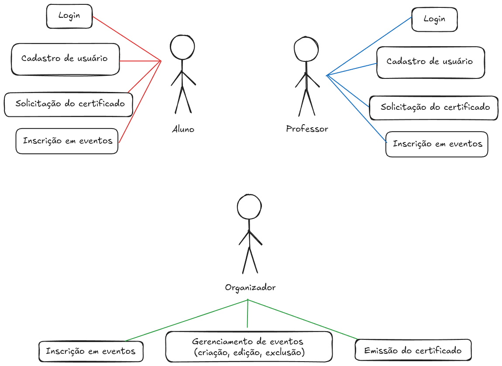

# Sistema de Gestão de Eventos Acadêmicos (SGEA)

Projeto Django para cadastro de usuários, gerenciamento de eventos acadêmicos, inscrições e emissão de certificados.

##### [Documentação Formal](docs/docs-prog-web.pdf)

## Alunos
- Ângelo: 22409042
- Augusto: 22400555
- Luana: 22404503

## Requisitos

- Python 3.13 (ou superior compatível)
- Virtualenv ativado (`python -m venv .venv && source .venv/bin/activate`)
- Banco de dados SQLite (arquivo `db.sqlite3` incluído)

## Configuração

1. Instale as dependências principais:

	```bash
	pip install -r requirements.txt
	```

	> Caso o arquivo `requirements.txt` não exista, instale manualmente: `pip install django fpdf2`.

2. Execute as migrações do banco:

	```bash
	python manage.py migrate
	```

3. Crie um usuário administrador:

	```bash
	python manage.py createsuperuser
	```

4. Rode os testes para validar as regras de negócio:

	```bash
	python manage.py test
	```

5. Carregue os dados de exemplo, população inicial dos dados:

	```bash
	python database/load_sample_data.py
	```

6. Suba o servidor de desenvolvimento e acesse o protótipo HTML/CSS:

	```bash
	python manage.py runserver
	```

	Abra http://127.0.0.1:8000 para visualizar o layout estático (templates em `api/templates/api/` e estilos em `api/static/api/`).

## Estrutura dos Modelos

- `Usuario`: extensão de `AbstractUser` com campos de nome, telefone, instituição e perfil (Aluno, Professor, Organizador, Admin).
- `Evento`: cadastro de eventos com tipo, período, local, capacidade e organizador responsável.
- `Inscricao`: vincula participantes (alunos/professores) aos eventos, controlando status, presença e limite de vagas.
- `Certificado`: emissão vinculada a inscrições confirmadas e com presença registrada, incluindo carga horária e validade.

O arquivo `docs/diagrama-logico.pdf` traz uma visão resumida das entidades e relacionamentos.

## Protótipo de Interface

- `api/templates/api/base.html`: layout base com navegação e rodapé.
- `api/static/api/styles.css`: estilos minimalistas responsivos.
- Fluxos específicos disponíveis em `/prototipos/`:
	- `/` ou `/prototipos/cadastro-usuarios/` – formulário e regras para criação de contas.
	- `/prototipos/cadastro-eventos/` – tela de cadastro de eventos com checklist do organizador.
	- `/prototipos/inscricao-usuarios/` – controle de inscrições, vagas e presença.
	- `/prototipos/emissao-certificados/` – emissão manual com pré-visualização.
	- `/prototipos/autenticacao/` – tela de login e recuperação de acesso.

Os templates usam `TemplateView` configurado em `gestor_eventos/urls.py` para facilitar a navegação durante a apresentação.

## Script SQL

O script `database/schema.sql` recria o banco SQLite (mesmo schema utilizado pelo Django) com constraints e dados iniciais (usuários, eventos, inscrições e certificado de exemplo). Execute-o via CLI: `sqlite3 db.sqlite3 < database/schema.sql`.

## Diagrama MER


## Representação Visual dos Casos de Uso

